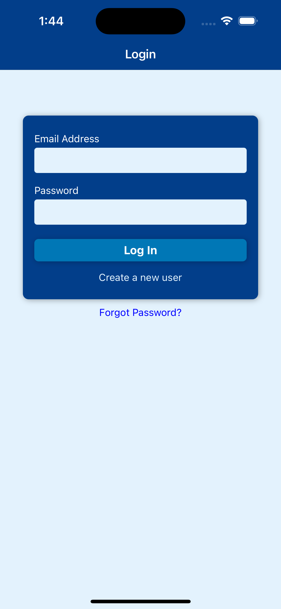
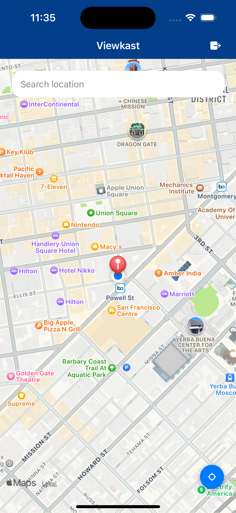
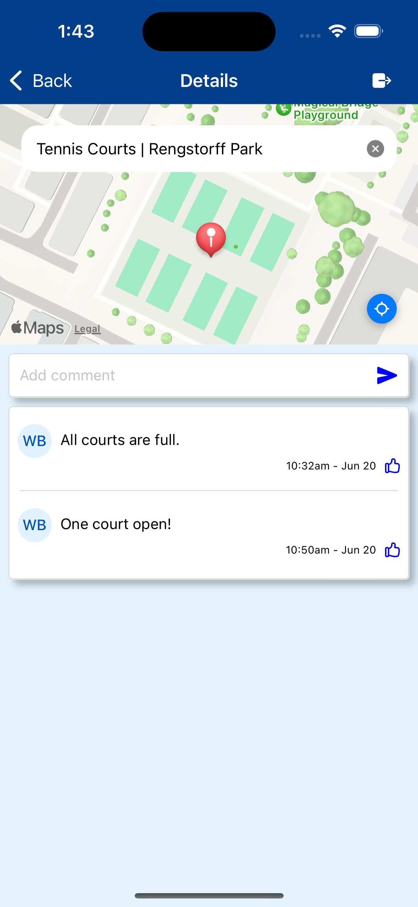
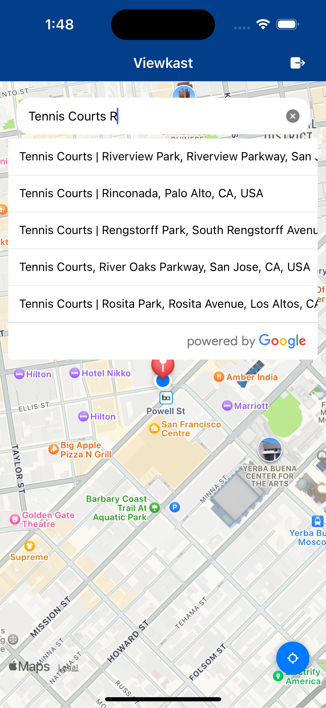

# Broadkast-react-native
* Note: This is the iOS/Android version of Broadkast developed using React Native. For my WEB version, click on the following links below:
[Broadkast README](https://github.com/benong777/Broadkast/blob/main/README.md)

* ( Web Video DEMO ):
https://www.youtube.com/watch?v=uR9E_H1A_zA

## Table of Contents

- [Introduction](#introduction)
- [Screenshots](#screenshots)
- [Usage](#usage)
- [Technologies](#technologies)
- [Requirements](#requirements)
- [Installation](#installation)

## Introduction

Social platform for users to communicate and post live updates of a particular location. For example, tennis players can alert others when courts are full and has a long wait.  Likewise, users can post when a parking lot is full or when tickets are sold out. Developed using React Native, Firebase Authentication and Firestore Database.

## Screenshots
 |
 |
 |
 |
 

## Usage

1. Search for a location to view posts. Ex: Disneyland.
2. Can create a new post by entering a message into the input field and pressing the submit button.

## Technologies

- React Native
- Firebase Authentication
- Firestore Database
- Google Places API
- Google Maps API
- Axios
- Javascript

## Requirements

1. Must have XCode (iOS) and Android Studio (Android) simulators installed.
2. Must have Google Places API key

## Installation

Clone project
git clone https://github.com/benong777/Broadkast-react-native.git

Install dependencies and run project. 
cd [project-directory]
npm install
npm run ios
